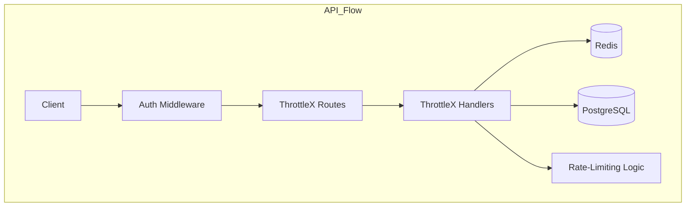

### **README for `api/` Folder**

#### **Overview**
The **`api/`** folder contains all code related to handling the API routes, request processing, and middleware for the ThrottleX project. This folder is responsible for defining the API endpoints, processing incoming requests, and interacting with other parts of the system (such as rate-limiting and authentication).

#### **Folder Structure**
```bash
api/
├── routes/
│   └── throttlex_routes.go   # Contains API route definitions
├── handlers/
│   └── throttlex_handler.go  # Handles request processing logic
├── middleware/
│   └── auth_middleware.go    # API key authentication logic
├── errors.go                 # Custom error definitions and handling
└── api.go                    # Main API setup and initialization
```

#### **Component Interaction Diagram**

Here’s a diagram showing how the **API** interacts with different components of the system, including **routes**, **handlers**, and **middleware**.



**Explanation**:
- The **Client** sends an API request to **ThrottleX**.
- The request goes through the **Auth Middleware**, which checks the API key and either blocks or allows the request.
- If valid, the request is routed by **ThrottleX Routes** (defined in `routes/`), which maps it to the correct handler.
- **Handlers** process the request by applying rate-limiting logic and interacting with **Redis** (for rate limit data) and **PostgreSQL** (for API key management).

---

#### **Files and Purpose**

1. **`api.go`**:  
   - The entry point for the API. It sets up the router, applies global middleware, and registers all the routes.
   - **Example**: Initializing the API and attaching middleware.

   ```go
   package api

   import (
       "github.com/gin-gonic/gin"
       "github.com/neelp03/throttlex/api/routes"
       "github.com/neelp03/throttlex/api/middleware"
   )

   // Setup initializes the API with routes and middleware
   func Setup() *gin.Engine {
       router := gin.Default()

       // Apply authentication middleware
       router.Use(middleware.AuthMiddleware())

       // Register routes
       routes.RegisterRoutes(router)

       return router
   }
   ```

2. **`routes/`**:  
   - Defines the API routes. Each route maps a URL path to a handler function.
   - **Example**: Defining an API route for checking rate limits.

   ```go
   package routes

   import (
       "github.com/gin-gonic/gin"
       "github.com/neelp03/throttlex/api/handlers"
   )

   // RegisterRoutes sets up all API routes
   func RegisterRoutes(router *gin.Engine) {
       router.GET("/api/throttlex/check", handlers.CheckRateLimit)
       router.POST("/api/throttlex/rate-limit", handlers.SetRateLimit)
   }
   ```

3. **`handlers/`**:  
   - Processes incoming requests. Each handler handles one or more API routes.
   - **Example**: Handler for checking the rate limit.

   ```go
   package handlers

   import (
       "github.com/gin-gonic/gin"
       "net/http"
   )

   // CheckRateLimit handles GET /api/throttlex/check
   func CheckRateLimit(c *gin.Context) {
       // Rate-limiting logic will be here
       c.JSON(http.StatusOK, gin.H{"message": "Rate limit check passed"})
   }
   ```

4. **`middleware/`**:  
   - Contains custom middleware logic. For example, **Auth Middleware** checks for a valid API key before allowing requests to proceed.
   - **Example**: Authenticating API keys.

   ```go
   package middleware

   import (
       "github.com/gin-gonic/gin"
       "net/http"
   )

   // AuthMiddleware checks API key validity for incoming requests
   func AuthMiddleware() gin.HandlerFunc {
       return func(c *gin.Context) {
           apiKey := c.GetHeader("X-API-KEY")
           if apiKey != "your_api_key" { // Replace with real validation
               c.JSON(http.StatusUnauthorized, gin.H{"error": "Unauthorized"})
               c.Abort()
               return
           }
           c.Next()
       }
   }
   ```

5. **`errors.go`**:  
   - This file contains custom error responses and error handling logic, ensuring consistent error messages and status codes across the API.

---

#### **How to Extend the API**

1. **Add a New Endpoint**:
   - Define a new handler in `handlers/`.
   - Register the new route in `routes/`.
   - Example: Adding a "reset rate limit" endpoint.
     - **Handler**:
     ```go
     func ResetRateLimit(c *gin.Context) {
         // Logic to reset rate limit for the API key
         c.JSON(http.StatusOK, gin.H{"message": "Rate limit reset"})
     }
     ```
     - **Route**:
     ```go
     router.POST("/api/throttlex/reset", handlers.ResetRateLimit)
     ```

2. **Add Custom Middleware**:
   - Add middleware in the `middleware/` folder and apply it globally or to specific routes.

---

#### **Future Enhancements**
- **Custom Error Handling**: Add more detailed error responses.
- **Rate-Limiting Policies**: Implement different rate-limiting algorithms like token bucket and sliding window.
- **Real-Time Monitoring**: Add middleware for logging requests and responses for Prometheus/Grafana monitoring.