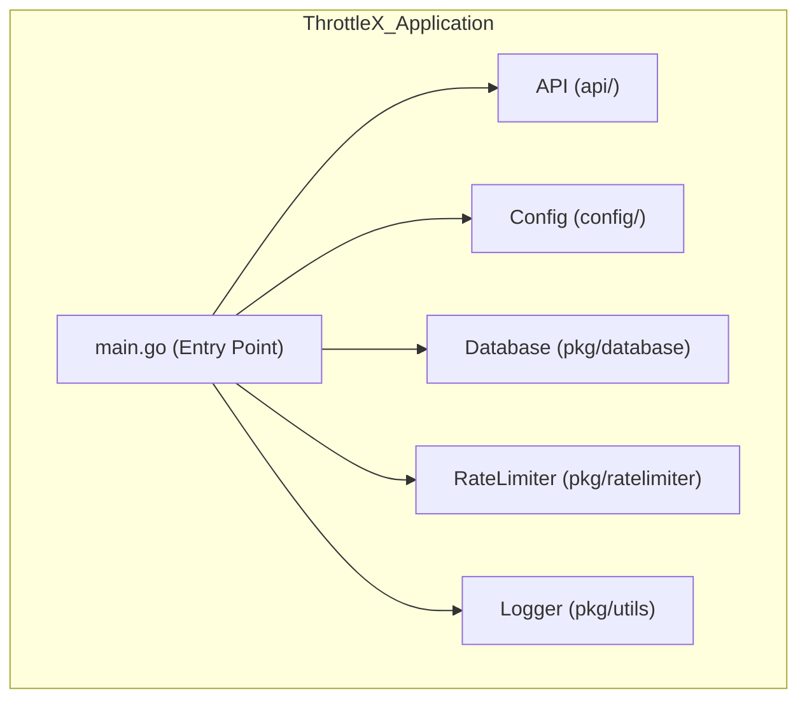

### **`cmd/` Folder README**

#### **Overview**
The **`cmd/`** folder contains the entry point of the **ThrottleX** application. This is where the main application logic starts, including initializing the API server, loading configurations, setting up database connections, and starting any necessary services (e.g., Redis). This folder is generally used to launch the application in production or for specific purposes like running a local development server.

#### **Folder Structure**

```bash
cmd/
└── throttlex/
    └── main.go    # Entry point for the ThrottleX application
```

#### **Component Interaction Diagram**

Here’s a **MermaidJS** diagram that shows how the `cmd/` folder interacts with other components of the ThrottleX project.



**Explanation**:
- **`main.go`** is the central entry point for the application.
- It sets up the **API**, loads the **configuration**, connects to the **database** (Redis and Postgres), initializes **rate limiting**, and configures **logging**.

---

#### **Files and Purpose**

1. **`main.go`**:  
   - The main entry point for starting the ThrottleX application. It handles the application’s bootstrapping process, such as initializing the API server, connecting to databases, loading configurations, and setting up logging.

   ```go
   package main

   import (
       "log"
       "os"
       "github.com/neelp03/throttlex/api"
       "github.com/neelp03/throttlex/pkg/database"
       "github.com/neelp03/throttlex/pkg/utils"
       "github.com/neelp03/throttlex/config"
   )

   func main() {
       // Load environment variables and config
       config.LoadConfig()

       // Initialize logging
       utils.InitializeLogger(os.Getenv("LOG_LEVEL"))

       // Set up Redis connection
       redisClient := database.InitializeRedis(
           os.Getenv("REDIS_HOST"),
           os.Getenv("REDIS_PASSWORD"),
           0, // DB number
       )

       if redisClient == nil {
           log.Fatal("Failed to initialize Redis")
       }

       // Initialize and run the API server
       router := api.Setup()
       err := router.Run(":" + os.Getenv("PORT"))
       if err != nil {
           log.Fatal("Failed to start server: ", err)
       }
   }
   ```

#### **How It Works**

1. **Configuration Loading**:  
   - The first thing the application does is load environment variables or configuration files using the `config` package. This ensures the application can run in different environments (local, staging, production).

   ```go
   config.LoadConfig()
   ```

2. **Logging Initialization**:  
   - The logger is initialized at the very start using the `utils` package to handle structured logging throughout the application.

   ```go
   utils.InitializeLogger(os.Getenv("LOG_LEVEL"))
   ```

3. **Redis and Database Connections**:  
   - The `main.go` sets up the connection to Redis and initializes other databases if needed. Redis is essential for handling rate limits.

   ```go
   redisClient := database.InitializeRedis(
       os.Getenv("REDIS_HOST"),
       os.Getenv("REDIS_PASSWORD"),
       0,
   )
   ```

4. **API Initialization**:  
   - After all the necessary services (like databases and logging) are initialized, the application sets up the API server, which includes defining routes and applying middleware.

   ```go
   router := api.Setup()
   ```

5. **Running the API Server**:  
   - The last step in the application startup is to run the server and listen on the specified port. If the server fails to start, the error is logged, and the program exits.

   ```go
   err := router.Run(":" + os.Getenv("PORT"))
   if err != nil {
       log.Fatal("Failed to start server: ", err)
   }
   ```

---

#### **Folder Usage**

- **`main.go`**: This file is the only entry point for the entire application. All other packages (API, rate-limiting logic, middleware) are initialized and used within this file.
- **Running the application**:
  - To run the application, simply execute:
    ```bash
    go run cmd/throttlex/main.go
    ```

- **Building the application**:
  - To create an executable:
    ```bash
    go build -o throttlex cmd/throttlex/main.go
    ```

---

#### **How to Extend**

1. **Additional Commands**:
   - If you plan to add more commands (e.g., a background worker or CLI tool), you can create new folders in `cmd/` like `cmd/worker/main.go` or `cmd/cli/main.go`. This keeps the commands separate and modular.
   
   **Example Structure**:
   ```bash
   cmd/
   ├── throttlex/
   │   └── main.go
   └── worker/
       └── main.go
   ```

2. **Different Configurations for Environments**:
   - You can easily switch between development, staging, and production environments by using environment-specific configuration files and flags.

---

#### **Future Enhancements**

- **Worker Processes**: If you need a background worker (for tasks like cleaning up expired rate limits), it can be implemented as a separate command in `cmd/worker/`.
- **CLI**: A command-line interface for interacting with the rate limiter (e.g., setting or checking rate limits) can be added as `cmd/cli/`.

---

### **Conclusion**

The **`cmd/`** folder in **ThrottleX** is the entry point for the application. It initializes essential services like logging, databases, and the API server. Keeping this logic in **`cmd/`** allows the project to scale with additional commands and entry points in the future.
