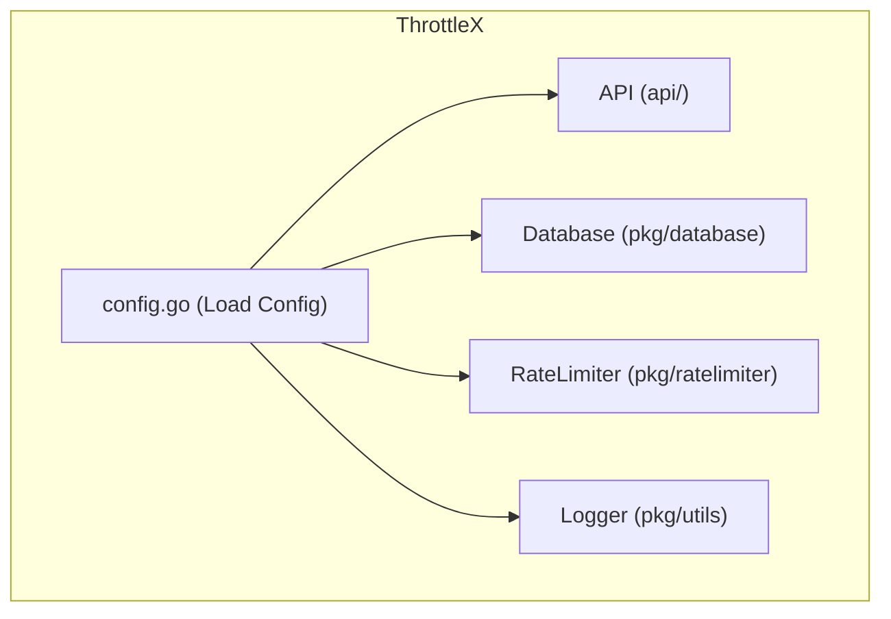

### **`config/` Folder README**

#### **Overview**
The **`config/`** folder handles the configuration settings for the **ThrottleX** application. These configurations include environment variables, database credentials, API keys, and other runtime settings that control the application's behavior. The configuration is essential for adapting the application to different environments (development, staging, production) and keeping sensitive data like API keys outside the codebase.

#### **Folder Structure**

```bash
config/
└── config.go    # Loads environment variables and application settings
```

#### **Component Interaction Diagram**

Here's a **MermaidJS** diagram showing how the configuration is loaded and used by different components of the application.



**Explanation**:
- **`config.go`** loads environment variables and other settings from the environment or configuration files.
- These settings are then passed to other components, such as the **API**, **Database**, **RateLimiter**, and **Logger**, to configure their behavior (e.g., Redis credentials, API keys, rate-limiting settings).

---

#### **Files and Purpose**

1. **`config.go`**:  
   - This file is responsible for loading configuration settings, such as environment variables. It ensures that all components of the application (API, database, rate limiter) can access the necessary settings.
   - The `config.go` file typically uses a package like `godotenv` or the `os` package to manage environment variables.

   ```go
   package config

   import (
       "github.com/joho/godotenv"
       "log"
       "os"
   )

   // LoadConfig loads environment variables from the .env file and the system environment
   func LoadConfig() {
       // Load from .env file, if it exists
       err := godotenv.Load()
       if err != nil {
           log.Println("No .env file found, using system environment variables")
       }

       // Check for required environment variables
       if os.Getenv("REDIS_HOST") == "" || os.Getenv("PORT") == "" {
           log.Fatal("Missing required environment variables: REDIS_HOST, PORT")
       }
   }
   ```

#### **Configuration Settings**

Here are the types of configuration settings you might have in **ThrottleX**:

1. **Database Settings**:  
   - **Redis**:  
     - `REDIS_HOST`: The Redis server host (e.g., `localhost:6379`).
     - `REDIS_PASSWORD`: The password for connecting to Redis (if any).
   - **PostgreSQL (if applicable)**:
     - `POSTGRES_HOST`: The PostgreSQL server host.
     - `POSTGRES_USER`: The database user.
     - `POSTGRES_PASSWORD`: The database password.
     - `POSTGRES_DB`: The database name.

2. **Server Settings**:  
   - `PORT`: The port on which the API server should listen.
   - `LOG_LEVEL`: The logging level (e.g., `info`, `debug`).

3. **Rate Limiting Settings** (Future Enhancements):  
   - `RATE_LIMIT_POLICY`: Controls which rate-limiting algorithm to use (e.g., `fixed_window`, `sliding_window`).
   - `REQUEST_LIMIT`: Number of allowed requests per window.
   - `WINDOW_DURATION`: Time duration for each rate-limiting window.

---

#### **How It Works**

1. **Loading Environment Variables**:  
   - The `LoadConfig()` function in `config.go` is responsible for loading the environment variables from the `.env` file (in development) or directly from the system environment (in production).

2. **Accessing Environment Variables**:  
   - Once the environment variables are loaded, they can be accessed using the `os.Getenv()` function anywhere in the application.

   **Example**:
   ```go
   redisHost := os.Getenv("REDIS_HOST")
   port := os.Getenv("PORT")
   ```

3. **Using Configuration in the Application**:
   - Other parts of the application (such as the **API**, **Database**, **RateLimiter**) will call the `LoadConfig()` function during the initialization phase to ensure all necessary settings are available.

   **Example** (in `main.go`):
   ```go
   import "github.com/neelp03/throttlex/config"

   func main() {
       // Load environment variables
       config.LoadConfig()

       // Use loaded config
       port := os.Getenv("PORT")
       router := api.Setup()
       router.Run(":" + port)
   }
   ```

---

#### **Environment Variables (.env Example)**

In development, you might want to use a `.env` file to store environment variables. Here’s an example `.env` file:

```bash
# Redis configuration
REDIS_HOST=localhost:6379
REDIS_PASSWORD=

# Server configuration
PORT=8080
LOG_LEVEL=debug

# Rate limiting settings (future)
RATE_LIMIT_POLICY=fixed_window
REQUEST_LIMIT=100
WINDOW_DURATION=1m
```

---

#### **How to Extend**

1. **Add New Configurations**:  
   - To add new configuration settings (e.g., database credentials or rate-limiting policies), simply add new environment variables in the `.env` file and access them using `os.Getenv()` in your code.

   **Example**: Adding a setting for rate-limiting policy.
   ```bash
   # .env
   RATE_LIMIT_POLICY=fixed_window
   ```

   **Accessing in Go**:
   ```go
   rateLimitPolicy := os.Getenv("RATE_LIMIT_POLICY")
   ```

2. **Load from External Sources**:  
   - If you need to load configuration from a more secure external source (e.g., AWS Secrets Manager, Google Cloud Secrets), this can be added to the `LoadConfig()` function.

---

#### **Future Enhancements**

- **External Configuration**: Implement loading configurations from cloud services or external sources for added security in production environments.
- **Multiple Environments**: Add support for different configuration files or settings for development, staging, and production environments.

---

### **Conclusion**

The **`config/`** folder in **ThrottleX** is responsible for loading and managing all configuration settings. These settings ensure that the application runs correctly in different environments by controlling how services like Redis, logging, and rate limiting are configured.
