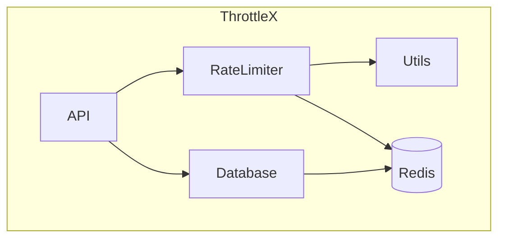

### **`pkg/` Folder README**

#### **Overview**
The **`pkg/`** folder contains reusable packages that can be shared across different parts of the ThrottleX project. These packages are designed to be modular, self-contained, and reusable. Common components, like rate-limiting algorithms, utility functions, or database connectors, will reside here to keep the codebase DRY (Don’t Repeat Yourself).

#### **Folder Structure**

```bash
pkg/
├── ratelimiter/
│   ├── ratelimiter.go      # Core rate-limiting logic (e.g., fixed window, sliding window)
│   └── token_bucket.go     # Token bucket rate-limiting algorithm
├── utils/
│   ├── config.go           # Configuration parsing (e.g., environment variables)
│   └── logger.go           # Logging utilities
└── database/
    └── redis.go            # Redis connection and helper functions
```

#### **Component Interaction Diagram**

Here’s a diagram showing how the **`pkg/`** folder's packages interact with other components in the project.



**Explanation**:
- The **API** makes use of the **RateLimiter** package to apply rate-limiting policies.
- The **RateLimiter** relies on **Redis** to track request counts and uses the **Utils** package for configuration or logging.
- The **Database** package manages the Redis connection and abstracts away Redis interactions for the rest of the system.

---

#### **Files and Purpose**

1. **`ratelimiter/`**:  
   - This folder contains all the rate-limiting algorithms and logic. Each rate-limiting method (e.g., fixed window, token bucket) is implemented as a separate file.
   - **Example**: A simple fixed window rate-limiting algorithm.

   ```go
   package ratelimiter

   import (
       "time"
       "github.com/go-redis/redis/v8"
       "context"
   )

   // FixedWindowLimiter applies rate-limiting using a fixed time window.
   func FixedWindowLimiter(ctx context.Context, redisClient *redis.Client, apiKey string, limit int, window time.Duration) (bool, error) {
       key := "ratelimit:" + apiKey
       count, err := redisClient.Incr(ctx, key).Result()
       if err != nil {
           return false, err
       }

       if count == 1 {
           redisClient.Expire(ctx, key, window)
       }

       if count > int64(limit) {
           return false, nil
       }

       return true, nil
   }
   ```

2. **`utils/`**:  
   - The **`utils/`** folder contains helper functions and utilities that are shared across the project. These might include configuration handling, logging, or other reusable functions.
   - **Example**: A logger utility that can be used throughout the project.

   ```go
   package utils

   import (
       "github.com/sirupsen/logrus"
   )

   var log = logrus.New()

   // InitializeLogger sets up the log level and format
   func InitializeLogger(level string) {
       if level == "debug" {
           log.SetLevel(logrus.DebugLevel)
       } else {
           log.SetLevel(logrus.InfoLevel)
       }
       log.SetFormatter(&logrus.JSONFormatter{})
   }

   // LogError logs an error with additional context
   func LogError(message string, err error) {
       log.WithFields(logrus.Fields{
           "error": err,
       }).Error(message)
   }
   ```

3. **`database/`**:  
   - This folder contains code for managing database connections, in this case with **Redis**. It abstracts away the details of connecting to Redis and provides easy-to-use functions to interact with Redis.
   - **Example**: Redis connection setup and helper functions.

   ```go
   package database

   import (
       "github.com/go-redis/redis/v8"
       "context"
   )

   var RedisClient *redis.Client

   // InitializeRedis sets up the Redis connection
   func InitializeRedis(addr, password string, db int) *redis.Client {
       RedisClient = redis.NewClient(&redis.Options{
           Addr:     addr,
           Password: password,
           DB:       db,
       })
       return RedisClient
   }

   // GetRateLimitCount retrieves the current request count for the given API key
   func GetRateLimitCount(ctx context.Context, apiKey string) (int64, error) {
       count, err := RedisClient.Get(ctx, "ratelimit:"+apiKey).Int64()
       if err != nil {
           return 0, err
       }
       return count, nil
   }
   ```

---

#### **How to Use the Packages**

1. **Rate Limiting**:
   - In your API layer, you can import the `ratelimiter` package and use the **FixedWindowLimiter** or **TokenBucketLimiter** to apply rate-limiting to incoming requests.

   **Example**:
   ```go
   import "throttlex/pkg/ratelimiter"

   allowed, err := ratelimiter.FixedWindowLimiter(ctx, redisClient, apiKey, 100, time.Minute)
   if err != nil {
       log.Fatal(err)
   }
   if !allowed {
       // Return 429 Too Many Requests
   }
   ```

2. **Logging**:
   - The **`utils`** package can be used across the project to handle logging. For example, log errors or info messages in your API handlers.
   
   **Example**:
   ```go
   import "throttlex/pkg/utils"

   utils.InitializeLogger("debug")
   utils.LogError("Failed to process request", err)
   ```

3. **Database**:
   - The **`database`** package handles Redis connections, so you can interact with Redis easily from other parts of the application.
   
   **Example**:
   ```go
   import "throttlex/pkg/database"

   redisClient := database.InitializeRedis("localhost:6379", "", 0)
   ```

---

#### **Future Enhancements**
- Add more rate-limiting algorithms (e.g., sliding window, token bucket).
- Expand the `utils/` package with more helper functions (e.g., string manipulation, error handling).
- Enhance the `database/` package with more database connectors if needed (e.g., PostgreSQL).